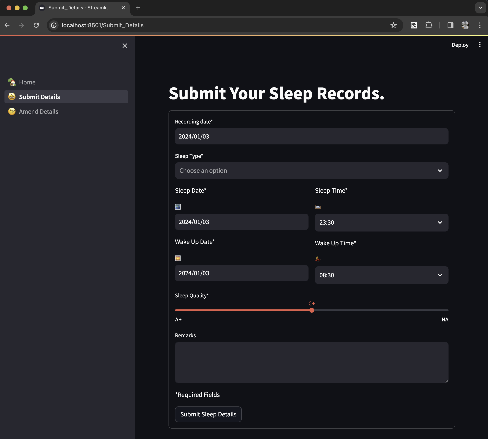
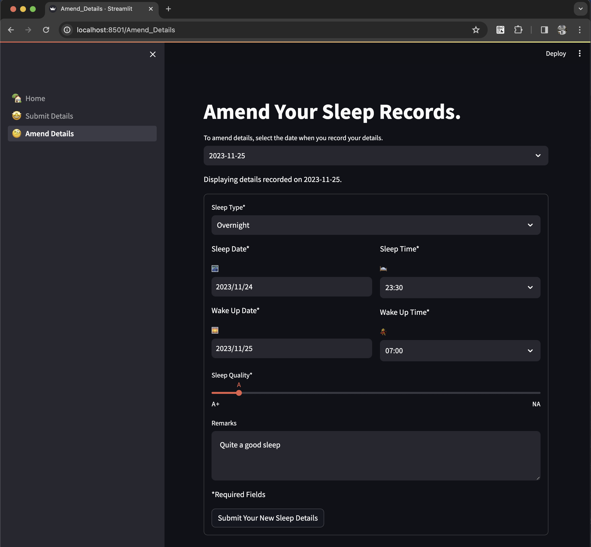

<div align="center">
  <h1>Sleep Tracker Web App 😴</h1>
</div>

## Introduction

This project is mainly created to log a person's sleep-related information. There are 2 main pages to this web app:<br>
1. Submit details page (for logging of sleep-related information).
   
2. Amend details page (for amending or updating previously submitted information).
   

## Project prerequisite
The prerequisites are simple. A valid Google account which you probably already have and an account with Streamlit.

Links to create accounts (if you have not created them):
1. [Google account](https://accounts.google.com/lifecycle/steps/signup/name?continue=https://myaccount.google.com?utm_source%3Daccount-marketing-page%26utm_medium%3Dcreate-account-button&dsh=S554448893:1704008136916243&flowEntry=SignUp&flowName=GlifWebSignIn&theme=glif&TL=AHNYTIQUWJ_R0SHQjbUNoq7ExQd-oSdQ0qQ4MFZkyobs4qcq6IxRLntGEwuCyxrR)
2. [Streamlit account](https://streamlit.io/)

## Tools required

The following tools are used for building this project.

| Tools | Purpose |
| :------------ | :------------- |
| [Google Sheets](https://www.google.com/sheets/about/#overview) | Cloud storage of sleep data |
| [Google Drive & Sheets API in Python](https://console.cloud.google.com/projectselector2/apis/dashboard?supportedpurview=project) | Interaction with Google Drive & Sheets |
| [Streamlit](https://streamlit.io/) | Framework to build and deploy web app |

## Getting Started
This tutorial is a reference from this [YouTube video](https://www.youtube.com/watch?v=_G5f7og_Dpo&t=249s) and the [gsheets-connection repo](https://github.com/streamlit/gsheets-connection/tree/main). Shout out to [Sven](https://github.com/Sven-Bo) for making this tutorial easily digestible.


### 1. Enable access for two APIs (Google Drive and Sheets)
From here onwards, you should already have a valid Google account and signed in to it.

- Go to [Google Developer Console](https://console.cloud.google.com/projectselector2/apis/dashboard?supportedpurview=project) and complete the following tasks.
  - Create a new project.<br>
    - Click on "Select a project" and "NEW PROJECT".
      

    - Give your project a name and click on "CREATE".
      

    - Make sure the project has been selected in the console.
      

  - Activate Google Drive and Google Sheets API.
    - Google Drive API.
      
      

    - Google Sheets API.
      
      

  - Create a service account to use the APIs.
    - Click on "Credentials", and select "+ CREATE CREDENTIALS" and "Service account".
      

    - Provide a name for the service account and click on "CREATE AND CONTINUE".
      

    - Enable read and write access for the service account by giving the "Editor" role. Click on "DONE" to grant access.
      

  - Create `secrets.toml` file
    - To obtain credentials for `secrets.toml` file, we need to create them first. Select the service account that you have just created.
    

    - Click on "KEYS" -> "ADD KEY" -> "Create new key" -> ensure Key type JSON is selected. Then click on "CREATE"
    

    - A `.json` file that contains the credentials should be automatically downloaded into your Downloads folder.
    

    - Create a `.streamlit` folder in the root directory of your working folder. Place the downloaded `.json` file into it. Create a new file called `secrets.toml`.
    - From your preferred IDE, open the working folder and both `.json` and `secrets.toml` files.
    - Copy the following format and paste it into `secrets.toml` file.
      ```
      # .streamlit/secrets.toml

      [connections.gsheets]
      spreadsheet = "<spreadsheet-name-or-url>"
      worksheet = "<worksheet-gid-or-folder-id>"  # worksheet GID is used when using Public Spreadsheet URL, when usign service_account it will be picked as folder_id
      type = ""  # leave empty when using Public Spreadsheet URL, when using service_account -> type = "service_account"
      project_id = ""
      private_key_id = ""
      private_key = ""
      client_email = ""
      client_id = ""
      auth_uri = ""
      token_uri = ""
      auth_provider_x509_cert_url = ""
      client_x509_cert_url = ""
      ```
    - Transfer the relevant information from `.json` file into the `secret.toml` file. Save `secrets.toml` file.
      

    - From `secrets.toml`, copy `client_email`. We need this email address from the service account to grant access to our Google Sheet.
    - Create a new Google sheet, and click on "Share". Paste `client_email` and click "Send".
    

    - Copy the URL of the Google sheet from the beginning until `/edit...`. Go back to `secrets.toml` and paste it into `spreadsheet`. Save `secrets.toml` file.
    
    - The `.json` file can be deleted.
  
  ### 2. Setting up workspace virtual environment

- Open up your command prompt or bash terminal. Go into your preferred location where you want to work on this project and create a directory.
  ```bash
  cd workspace
  mkdir sleep_tracker
  cd sleep_tracker
  ```

- Create a virtual environment.
  ```bash
  pip install virtualenv
  virtualenv venv
  ```

- Activate the virtual environment.
  ```bash
  # if you are on Windows OS
  source venv/Scripts/activate

  # if you are on Mac OS
  source venv/bin/activate
  ```

- Install the following basic packages needed for this project.
  ```bash
  pip install st-gsheets-connection streamlit pandas
  ```

### 3. Test if Streamlit is working with Google Sheets

- After installing the packages, we do a test to see if Streamlit can run. Create an `app.py` in the root directory of your project folder.

  ```python
  # app.py
  import streamlit as st
  from streamlit_gsheets import GSheetsConnection
  import pandas as pd

  # display welcome messages
  st.title('Welcome to the home page.')
  st.markdown('This is a test that your installed packages are working.')

  # setup connection with google sheets
  conn = st.connection('gsheets', type=GSheetsConnection)

  # fetch data from google sheets
  gsheet_data = conn.read(worksheet='sleep', usecols=list(range(9)), ttl=5)
  gsheet_data.dropna(how='all', inplace=True)

  # display google sheet data as pandas dataframe
  st.dataframe(gsheet_data)
  ```

- Execute the Python file from the terminal.
  ```bash
  streamlit run app.py
  ```

- When the Python file is executed, your Streamlit app will automatically open in your browser and if you have any data in your Google Sheets, it should display.
  

- To exit the app, type 'CTRL + C' at the terminal. The app is only closed when you close it from the terminal.

### Congratulations, you have a working Streamlit app!
